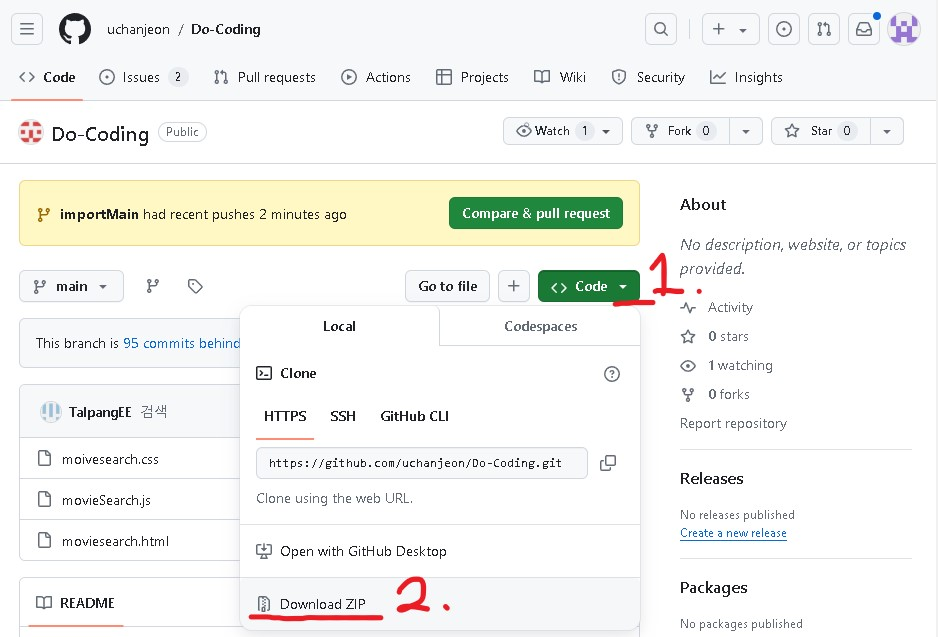

# 1. 프로젝트명 : 상영 중인 영화 검색 사이트

## 2. 프로젝트의 주요 기능과 목적

현재 상영 중인 영화들의 정보를 가져와 카드로 배열하고, 상단부에 검색어를 입력해 검색할 수 있는 사이트입니다.  
카드를 클릭하면 상세 페이지로 넘어가며 영화 제목, 평점, 개봉일, 개요, 감독과 출연자, 영화 예매사이트, 트레일러를 보여줍니다. 
JQuery를 사용하지 않고 바닐라 자바스크립트로 API로 파일을 받고 필요한 정보만을 이용할 수 있는 지를 체크하기 위해 시작했습니다.

## 3. 설치 방법

사진과 같이 [GitHub Link](https://github.com/uchanjeon/Do-Coding/tree/main)에서 ZIP를 다운 받아주세요. 
그리고 home.html을 Live Server를 통해서 웹사이트를 열어주시면 됩니다. 
(html 파일을 직접 여는 경우, CORS 에러 발생)

## 4. 사전 요구사항

1. JavaScript ES6
2. HTML5 postMessage 기능을 지원하는 브라우저

## 5. 문제 해결 방법

F12를 눌러 CONSOLE 태그에 사진과 같은 에러코드가 나온다면
 
Live Server를 이용해서 실행해주세요.

## 6. 지원창구

추가적인 질문이나 제안을 하실 때는 Github의 Issue기능을 이용해주세요.

## 7. 외부리소스

1. [TMDB API Now Playing](https://developer.themoviedb.org/reference/movie-now-playing-list)
2. [TMDB API Videos](https://developer.themoviedb.org/reference/movie-videos)

## 8. 참조

[iframe 삽입에 대한 YouTube Player API 참조 문서](https://developers.google.com/youtube/iframe_api_reference?hl=ko)
